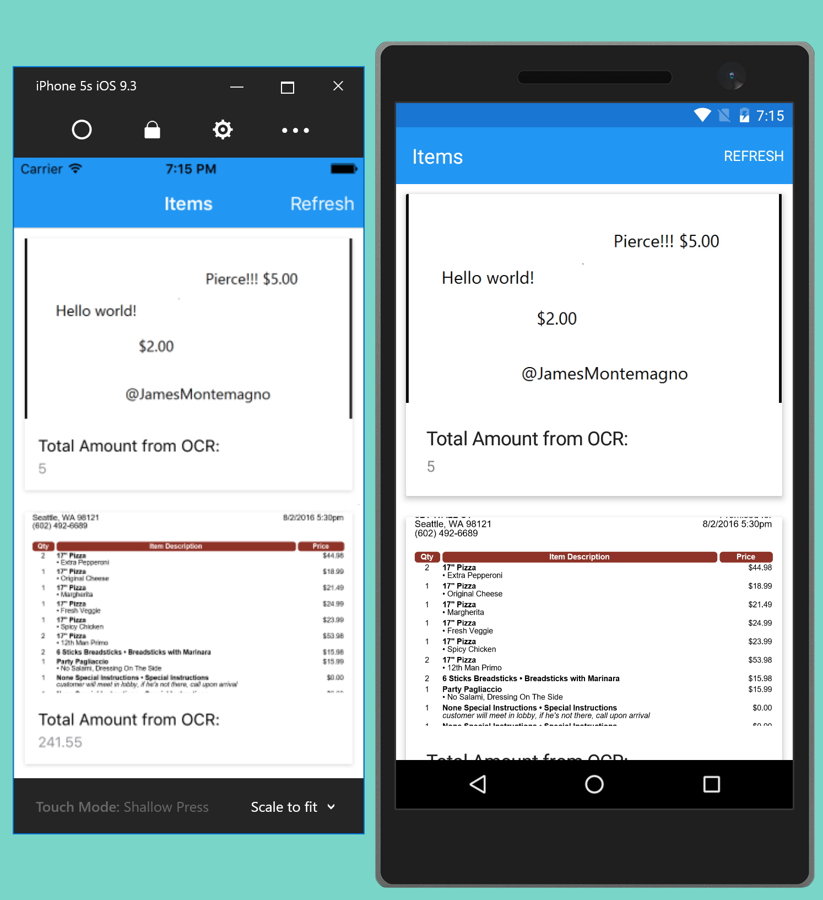

OCRDemo = Nano-Services with Azure Functions
=========
Simply open up the OCRItemsDataPage.xaml and enter your Azure Mobile App backend URL




## Azure Functions Setup
Read the full blog at:


See the video:
<iframe width="640" height="480" src="https://www.youtube.com/embed/TImd9RGdreQ" frameborder="0" allowfullscreen></iframe>

## Core for Azure Functions
```csharp
#r "Microsoft.WindowsAzure.Storage"
#r "System.Runtime"
#r "System.Threading.Tasks"
#r "System.IO"

using System;
using System.Linq;
using System.Runtime;
using System.Threading.Tasks;
using Microsoft.WindowsAzure.Storage.Blob;
using Microsoft.ProjectOxford.Vision;

public static void Run(ICloudBlob myBlob, TraceWriter log, out object outputRecord)
{
    var client = new VisionServiceClient("YOUR_API_KEY");
   
    log.Info($"C# Blob trigger function processed: {myBlob.Uri.ToString()}");
    
    var url = myBlob.Uri.ToString();
    var result = client.RecognizeTextAsync(url).Result;
    
     var words = from r in result.Regions
        from l in r.Lines
        from w in l.Words
        select w.Text;

    var output = string.Join(" ", words.ToArray());
    
    log.Info($"Complete output from OCR: {output}");
   
   
    var numbers = from word in words
                where word.Contains("$")
                select word.Replace("$", "");

    double temp = 0.0;
    var total = numbers.Count() == 0 ? 0.0 : numbers.Select(x => double.TryParse(x, out temp) ? temp : 0).Max();

    log.Info($"We found the total of: {total}");

    // 3. Add to data-bound collection.
    outputRecord = new 
    {
        Total = total,
        TimeStamp = DateTime.UtcNow,
        Url = url,
        Text = output
    };
   
}
```